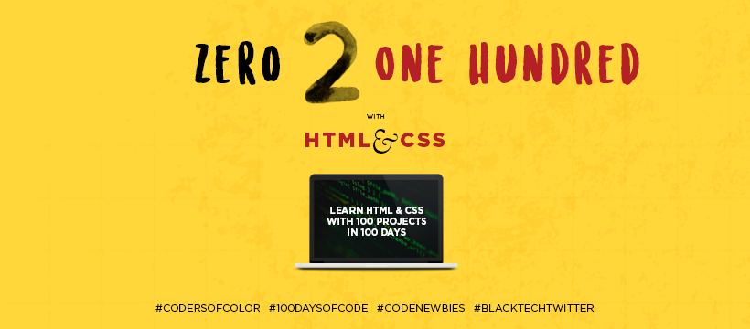

# Zero 2 One Hundred with HTML &amp; CSS

## Welcome
Zero 2 One Hundred with HTML &amp; CSS is an ongoing project based series made to help you get familiar and get started with HTML &amp; CSS basics. Each project will teach how to work with both HTML &amp; CSS to create common and complex web UI elements. 

## WHY
Learning can be hard and everyone learns in a different way. I made this just hoping that I could help a few people get over the initial feeling of being lost when starting out with code. Feel free to contact me if you need help or have questions on my personal and business social accounts. [Personal Twitter](https://twitter.com/cortneyisms) | [COC Twitter](https://twitter.com/codersofcolor_)

## Find me
Here are some of the places you can find me
- [YouTube][youtube]
- [Twitter][twitter]
- [Github][github]

## How To Share
Please take a second and share with a friend or just post on your social accounts. Thanks!

  [Share on Twitter][shareTwitter] | [Share on LinkedIn][shareLinkedin] | [Share on Facebook][shareFacebook] | [MailToAfriend](mailto:friend@example.com?&subject=Learn-Html-and-CSS&body=https://github.com/CodersofColor/Zero-to-100-with-HTML-and-CSS )

## Course Contents

| Session         | Topic              | Project Links                             |
| :-------------- | :----------------- | :---------------------------------------- |
| 1 - Setup       | Setting up VScode  | [Sandbox][01-sandbox]                     |
| 2 - Basics      | Box Model & Basics | [Sandbox][02-sandbox] / [Final][02-final] |
| 3 - Positioning | CSS Positions      | [Sandbox][03-sand] / [Final][03-final]    |

[//]: <> (Share Links)
[shareFacebook]: https://www.facebook.com/sharer/sharer.php?u=https%3A%2F%2Fgithub.com%2FCodersofColor%2FZero-to-100-with-HTML-and-CSS

[shareTwitter]: https://twitter.com/intent/tweet?url=https%3A%2F%2Fgithub.com%2FCodersofColor%2FZero-to-100-with-HTML-and-CSS&text=Zero%202%20One%20Hundred%20with%20HTML%20and%20CSS 

[shareLinkedin]: http://www.linkedin.com/shareArticle?mini=true&url=https%3A%2F%2Fgithub.com%2FCodersofColor%2FZero-to-100-with-HTML-and-CSS&title=Zero%202%20One%20Hundred%20with%20HTML%20and%20CSS

[//]: <> (Social Links)
[youtube]: https://www.youtube.com/channel/UC50BFllxOlLGyLxrBrluSzQ
[twitter]: https://twitter.com/codersofcolor_
[github]: https://github.com/CodersofColor/Zero-to-100-with-HTML-and-CSS

[//]: <> (Session Links)
[01-sandbox]: ./src/01_Setup/index.html
[02-sandbox]: ./src/02_Box_Model/_sandbox_/
[02-final]:  ./src/02_Box_Model/final-02/
[03-sand]: ./src/03_positioning/_sandbox/
[03-final]: ./src/03_positioning/final-03/